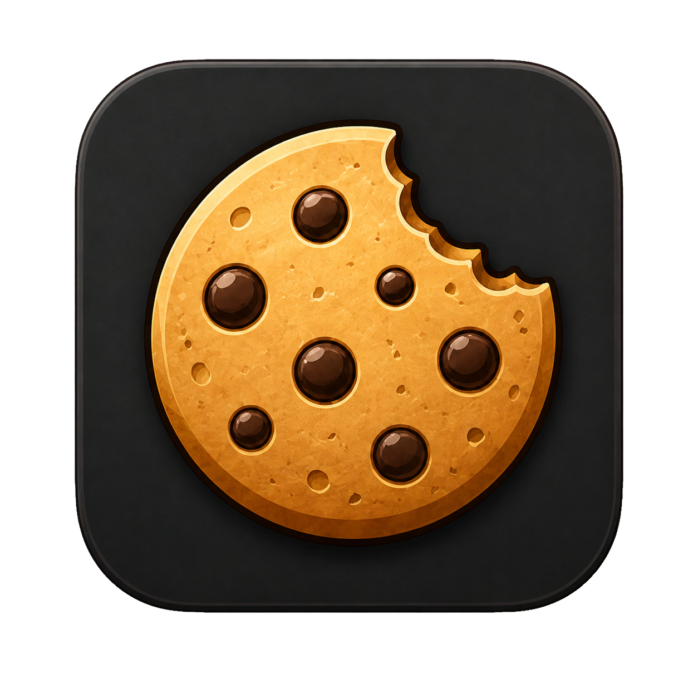
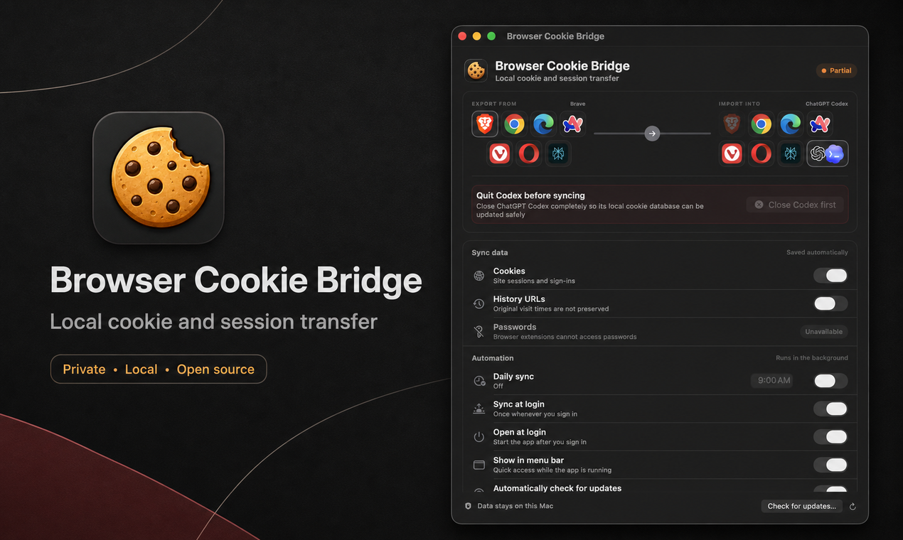

<div align="center">



<h1>Browser Cookie Bridge</h1>

<strong>Move signed-in sessions locally—or explicitly upload one to Browserless Cloud.</strong>

<p>Brave, Chrome, Edge, Arc, Vivaldi, Opera, and Comet · ChatGPT Codex import · optional Browserless authenticated profiles.</p>

<p>
  
  
  
  <a href="https://www.npmjs.com/package/browser-cookie-bridge"></a>
  
  
  <a href="https://www.producthunt.com/products/browser-cookie-bridge"></a>
  
</p>

<p>
  <a href="#installation"><b>Install</b></a> ·
  <a href="https://github.com/apoorvdarshan/browser-cookie-bridge/releases/latest">DMG</a> ·
  <a href="https://www.npmjs.com/package/browser-cookie-bridge">npm</a> ·
  <a href="#how-it-works">How it works</a> ·
  <a href="#security--privacy">Security</a> ·
  <a href="CONTRIBUTING.md">Contribute</a> ·
  <a href="https://github.com/apoorvdarshan/browser-cookie-bridge/issues/new?template=bug_report.yml">Report a bug</a> ·
  <a href="https://www.producthunt.com/products/browser-cookie-bridge">Product Hunt</a> ·
  <a href="#support">Support</a>
</p>

<p>
  <a href="https://github.com/apoorvdarshan/browser-cookie-bridge/releases/latest/download/Browser-Cookie-Bridge-arm64.dmg"><b>Download for Apple silicon</b></a>
  · <a href="https://github.com/apoorvdarshan/browser-cookie-bridge/releases/latest/download/Browser-Cookie-Bridge-x64.dmg">Download for Intel</a>
</p>

<br />



</div>

---

> **Version 1.2.0 adds an optional Browserless Cloud destination.** It is destination-only, manual-only, and visually separated from local transfers. Importing into ChatGPT Codex remains an intentionally unsupported direct integration and requires Codex to be completely closed.

## Why Browser Cookie Bridge

Signing into the same sites across several browsers is repetitive. Export files are awkward, password managers do not move active sessions, and ChatGPT Codex does not currently offer a Brave import button.

Browser Cookie Bridge gives those browser profiles a small, native control panel. Local browser and Codex transfers stay on the Mac. If you explicitly select Browserless Cloud and click Upload, the app can instead send authenticated profile state to your own Browserless account.

## Features

- 🍪 **Cookie and session transfer** — cookies are enabled by default, including supported domain, path, expiry, security, `SameSite`, and partition attributes.
- 🌐 **Seven Chromium browsers** — Brave, Chrome, Edge, Arc, Vivaldi, Opera, and Perplexity Comet can be sources or destinations.
- ✨ **ChatGPT Codex import** — merge selected local browser data into Codex's built-in browser; Codex is destination-only.
- ☁️ **Optional Browserless upload** — create or refresh a Browserless authenticated profile with cookies, local storage, and IndexedDB; Browserless is destination-only and manual-only.
- 🕘 **Background automation** — sync when you sign in, at a fixed daily time, or whenever you choose.
- ◉ **Native menu-bar app** — closing the window removes the Dock icon while the helper continues running.
- 🧯 **Backup and rollback** — Codex's database is backed up, modified on a separate copy, integrity-checked, and restored if replacement fails.
- ⬆️ **Built-in updates** — checks for GitHub releases, verifies the DMG checksum, installs in place, and relaunches the app.
- 🔒 **Local-first** — local paths use no account, analytics, cookie logs, or remote relay; the separate Browserless path runs only after explicit selection and confirmation.

## What it transfers

| Data | Support | Notes |
|---|---:|---|
| **Cookies and sessions** | ✅ Default | Transfers supported cookie values and attributes |
| **History URLs** | ◐ Optional | Original visit times and page titles cannot be preserved |
| **Local storage and IndexedDB** | ◐ Browserless only | Included only in an explicit Browserless authenticated-profile upload |
| **Passwords** | — Never | Chromium extensions cannot read the browser password store |
| **Bookmarks, autofill, payments** | — Never | Not requested or accessed |
| **iCloud Keychain** | — Never | Remains completely separate |

Some websites bind sessions to a specific device or browser and may ask you to sign in again after a transfer.

## Requirements

- **macOS 13.5+**
- A supported Chromium browser, or ChatGPT Codex as the destination

The DMG is self-contained. Node.js 24+ and Xcode Command Line Tools are required only for npm or source installation.

## Installation

### Download a DMG — recommended

- **[Apple silicon DMG](https://github.com/apoorvdarshan/browser-cookie-bridge/releases/latest/download/Browser-Cookie-Bridge-arm64.dmg)** — M1, M2, M3, M4, and newer
- **[Intel DMG](https://github.com/apoorvdarshan/browser-cookie-bridge/releases/latest/download/Browser-Cookie-Bridge-x64.dmg)** — Intel-based Macs

Open the DMG, drag **Browser Cookie Bridge** onto **Applications**, then open it from Applications. The current public build is checksum-verified and ad-hoc signed but not Apple-notarized, so macOS may require **Control-click → Open** on first launch. It does not require Node.js, Xcode, Terminal, or an administrator password.

### Via npm

Run the published package directly:

```bash
npx browser-cookie-bridge install-app
```

No administrator password is needed. The app is built from source on your Mac and installed in your user Applications folder unless an existing writable system Applications copy is being updated.

Both installation methods use the same bundle identifier and the same settings under `~/Library/Application Support/BraveCodexCookieSync`. Installing the DMG after npm does not create a separate product identity: the system Applications copy becomes canonical, and a stale matching user Applications copy is moved to the Trash on launch. Future updates replace that same app in place.

**[View `browser-cookie-bridge` on npm →](https://www.npmjs.com/package/browser-cookie-bridge)**

### From source

```bash
git clone https://github.com/apoorvdarshan/browser-cookie-bridge.git
cd browser-cookie-bridge
npm test
npm run build:app
```

The final command compiles the native SwiftUI app, enables **Open at login**, **Sync at login**, and the **menu-bar helper**, then launches it. A first install uses `~/Applications/Browser Cookie Bridge.app` without requesting administrator access. If an existing `/Applications/Browser Cookie Bridge.app` is present, later builds and updates keep using that system Applications copy instead of creating a duplicate. Daily sync stays off until you enable it.

## Setup

### Browser → ChatGPT Codex

No browser extension is needed for this path.

1. Select a source browser and **ChatGPT Codex** as the destination.
2. Quit Codex completely. Closing only its browser panel is not enough.
3. Choose **Cookies** and, optionally, **History URLs**.
4. Press **Sync now** and reopen Codex after the success message.

If Codex is open, the app blocks the transfer and tells you what to close. It never force-quits Codex.

### Browser → browser

Browser-to-browser transfers use a small unpacked extension at each selected endpoint.

1. Run `browser-cookie-bridge setup --no-schedule` or use the app's extension setup action.
2. Open the extensions page in both browsers and enable **Developer mode**.
3. Choose **Load unpacked** and select the generated `extension-<browser>` folder for each endpoint.
4. Keep both browsers open, select the same endpoints in the app, then press **Sync now**.

Generated extensions live under `~/Library/Application Support/BraveCodexCookieSync/` and contain a random, user-only local broker token. Do not share those folders.

### Browser → Browserless Cloud (optional)

This path uses the official Browserless CLI and is deliberately separate from local sync.

1. Select **Browserless Cloud** as the destination.
2. Enter your Browserless API token, cloud profile name, region, and optional domain allowlist. The token is stored in macOS Keychain; it is never written to the app configuration or command arguments.
3. Quit the selected source browser so its profile can be copied consistently.
4. Review the cloud warning and click **Upload now**.

The upload creates the named Browserless profile the first time and refreshes it on later runs. It may contain cookies, local storage, and IndexedDB; history and saved passwords are excluded. Browserless uploads never run from Daily sync or Sync at login. Browser Cookie Bridge disables Browserless CLI telemetry for this integration. Comet is not currently supported by the Browserless capture CLI.

The official CLI records the Browserless upload-disclaimer acceptance timestamp in `~/.browserless/config.json`. Browser Cookie Bridge does not store its API token there.

## Usage

| Control | What it does |
|---|---|
| **Export from** | Selects the browser whose data will be read |
| **Import into** | Selects a different browser, ChatGPT Codex, or optional Browserless Cloud |
| **Cookies** | Moves cookies and supported session attributes; on by default |
| **History URLs** | Adds visited URLs without their original timestamps or titles |
| **Daily sync** | Runs at one fixed local time; off by default |
| **Sync at login** | Runs once whenever you sign in; on by default |
| **Open at login** | Starts the background app after macOS login; on by default |
| **Show in menu bar** | Keeps sync, status, updates, and support actions close at hand |
| **Check for updates** | Finds a newer GitHub release, verifies its DMG, and offers install + relaunch |

Automation uses the saved source, destination, and data choices for local transfers. A scheduled Codex sync safely exits without making changes when Codex is open. Browserless cloud uploads are always manual and require an explicit upload action.

## CLI

```bash
browser-cookie-bridge install-app [--no-open]
browser-cookie-bridge setup [--hour 9] [--minute 0] [--no-schedule]
browser-cookie-bridge preferences --source brave --target codex --cookies on --history off
browser-cookie-bridge sync [--timeout 300] [--allow-cloud-upload]
browser-cookie-bridge doctor
browser-cookie-bridge enable-login-sync
browser-cookie-bridge disable-login-sync
browser-cookie-bridge enable-app-login
browser-cookie-bridge disable-app-login
browser-cookie-bridge remove-schedule
```

Supported source IDs are `brave`, `chrome`, `edge`, `arc`, `vivaldi`, `opera`, and `comet`. Target IDs are the same plus `codex` and `browserless`. The same browser cannot be both endpoints. Browserless requires `BROWSERLESS_TOKEN` and the explicit `--allow-cloud-upload` flag; the native app supplies the token from Keychain without placing it in the OS command line or app configuration.

## How it works

| Path | Transfer method |
|---|---|
| **Browser → browser** | Unpacked extensions connect to a short-lived broker on IPv4 loopback. Selected data stays in memory and is never written to logs. |
| **Browser → Codex** | The app reads the selected local Chromium profile, creates a consistent Codex SQLite backup, merges into a working copy, validates it, then replaces the destination atomically. |
| **Browser → Browserless** | The bundled official Browserless CLI copies a closed local profile, captures cookies/local storage/IndexedDB, and uploads it directly to the selected Browserless region. |

The broker validates a random token and extension origin, limits payload size, and normally exits after five minutes. Only the endpoints selected in the app respond to a transfer.

## Security & privacy

- Cookie values and history URLs are never logged.
- Browser-to-browser data is held only in broker memory.
- Codex backups are stored with user-only permissions under `~/Library/Application Support/BraveCodexCookieSync/backups/codex`; the newest 14 are retained.
- The app refuses unknown Codex database schemas instead of guessing.
- Imported Codex rows use an empty `encrypted_value` because OpenAI's Safe Storage key is protected by a private macOS Keychain access group. Those imported rows can therefore remain readable to software running as your macOS user until the website refreshes them.
- Anyone who can use your logged-in macOS account or modify a generated extension may be able to access transferred browser sessions.
- The optional Browserless destination sends authenticated state to Browserless under their terms and privacy practices. Its API token is stored in macOS Keychain, uploads are manual, and Browserless CLI telemetry is disabled by the app.

Cookies are credentials. Review the source, protect your macOS account, and transfer only between profiles you trust.

Found a vulnerability? Read [SECURITY.md](SECURITY.md) and report it privately. Do not open a public issue or include real browser data.

## Releases

Pushing a semantic version tag runs tests, validates that package and app versions match, builds separate Apple-silicon and Intel DMGs, publishes to npm, and creates a GitHub Release with the tarball, DMGs, and SHA-256 files attached.

```bash
npm run release:check
git tag vX.Y.Z
git push origin vX.Y.Z
```

A normal branch push does not publish anything.

## Contributing

Contributions are welcome. See [CONTRIBUTING.md](CONTRIBUTING.md) for local setup, validation, privacy requirements, and pull request guidance.

## Support

If Browser Cookie Bridge is useful to you:

- ⭐ **Star** the repository
- ⬇️ **[Download the latest DMG](https://github.com/apoorvdarshan/browser-cookie-bridge/releases/latest)**
- 📦 **[Install from npm](https://www.npmjs.com/package/browser-cookie-bridge)**
- 🐛 **[Report a bug](https://github.com/apoorvdarshan/browser-cookie-bridge/issues/new?template=bug_report.yml)** — never include cookie values or tokens
- ☕ **[Support on Ko-fi](https://ko-fi.com/apoorvdarshan)**
- 𝕏 **Follow [@apoorvdarshan](https://x.com/apoorvdarshan)**
- 🚀 **[View on Product Hunt](https://www.producthunt.com/products/browser-cookie-bridge)**

Product screenshots, the transparent cookie logo, and launch artwork live in [`marketing/`](marketing/).

## Website

The product landing page, documentation overview, Privacy Policy, and Terms are live at **[cookiebridge.apoorvdarshan.com](https://cookiebridge.apoorvdarshan.com)** and live in [`web/`](web/). Preview them locally at `http://localhost:3000`:

```bash
npm run web
```

## License

[MIT](LICENSE) © 2026 [Apoorv Darshan](https://github.com/apoorvdarshan)

<sub>Not affiliated with Brave, Google, Microsoft, The Browser Company, Vivaldi, Opera, Perplexity, OpenAI, or Browserless. Their names and marks belong to their respective owners.</sub>
